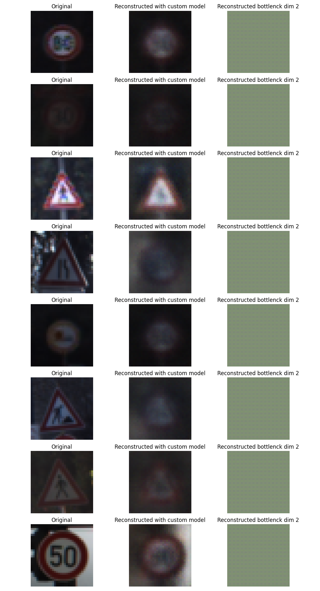
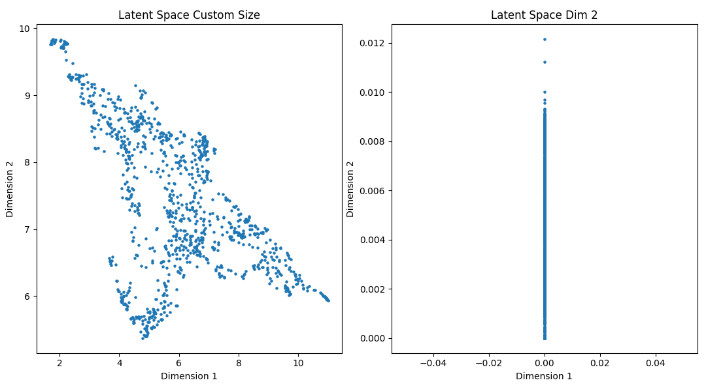
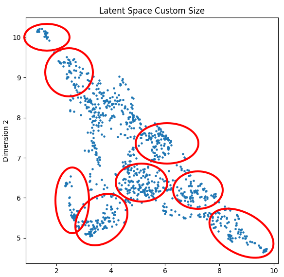
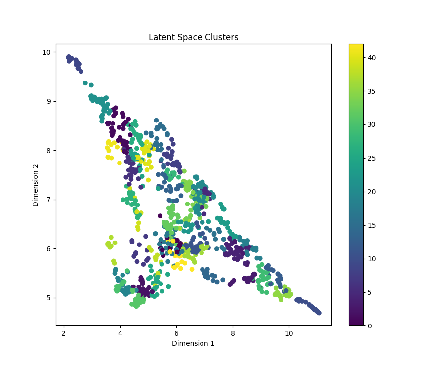

### Workflow

The training approach is always training the 2 sized bottleneck along with the input custom size. To ensure the non-familiarity with test data for both models, I chose to save the test data fin the training file to be used later in the latent space analysis. The test data file is replaced with every training.

### Structure of the project

- `data/` : contains the data files( downloaded in the training script for torchvision datasets)
- `model/autoencoder.py` : the structure of the autoencoder
- `train.py` : the training script for both models, fixed 2 sized bottleneck and custom input sized and saving the test data.
- `viz_reconstruction.py` : the script for visualizing the reconstruction of the test data comparing the 2 models performance.
- `encode_latent_space.py` : script to use the encoder part to generate the latent space of from a number of input images (e.g. 1000), the results are saved in `.npy` numpy file.
- `viz_latent_space.py` : script to visualize both latent spaces of both models and compare them, in the argument you have the choice of using UMAP or t-SNE.
- `viz_kmeans_latent_space.py` : script to visualize the clustered latent space using k-means.
- requirements.txt : the requirements file for the project.
- `notebook_alternative.ipynb` : the notebook for this project instead running scripts internally in terminal.
- model/ : the folder containing the saved models, test data, and latent spaces.
### Dataset description
GTSRB (German Traffic Sign Recognition Benchmark)
- Size : 26640
- 43 classes
### Usage guide

Training the models:

```bash
python train.py --num_epochs 10 --latent_size 256 --batch_size 128 --lr 0.0001
```
Note : the only required argument is latent_size, the rest are optional(defaults as displayed).


Visualizing the reconstruction:

```bash
python viz_reconstruction.py --model_path output/model_latent_size_256.pth --test_data output/test_data.pth
```

Note : the only required argument is latent_size, the rest are optional(defaults as displayed).

Encoding the latent space:

```bash
python encode_latent_space.py --model_path output/model_latent_size_256.pth --test_data output/test_data.pth --num_samples 1000
```
Note : the only required argument is latent_size, the rest are optional(defaults as displayed).

Visualizing the latent space:

```bash
python viz_latent_space.py --latent_space output/latent_space_size_256.npy --vis_type umap
```

Vizualizing clustered umap reduced latent space with k-means:

```bash
python viz_kmeans_latent_space.py --latent_space output/latent_space_size_256.npy --num_clusters 43
```

## Reconstruction results

<div align="center">
  
</div>


<!# Questions

### 1. Can you identify meaningful cluster structures for the test samples in the latent space?

The dataset is of real world images with 43 classes, there is a lot common visual features, having the autoencoder trained in a unsupervised fashion makes it hard to identify clusers based on visual inspection. But we notice collections of data points centralizing in a variety of regions in the latent space. This example is for the 256 sized latent space trained for 20 epochs. Larger latent dim and more epochs plus hyperparameter fine tuning can improve the clustering.
<div align="center">
  
</div>

### 2. Do the classes cluster well?

The classes cluster moderately well for the reasons mentionned above. In the chosen dataset there are 43 classes but in the following figure we can visually identify an approximation (circled in red).
To extend the clustering analysis on the latent space, I have added a k-means that works on dimensionally reduced space with UMAP as illustrated in the following figure.

<div align="center">
  <a>
    
  </a>
  <!-- Add space between the two images -->
  <span style="display:inline-block;width:0px;"></span>  

  <a>
    
  </a>

</div>

### 3. How do the two representations learned from the two models compare?
Limiting the latent space to dim2 makes it hard to compare the two models, but we can see that the custom sized latent space (256) is more spread out whereas the fixed sized latent space (2) is more compact to the least. Using 2 as dim for the latent space is not enough to capture the complexity of the dataset as we can also notice the reconstruction from the latter in the first figure.>
